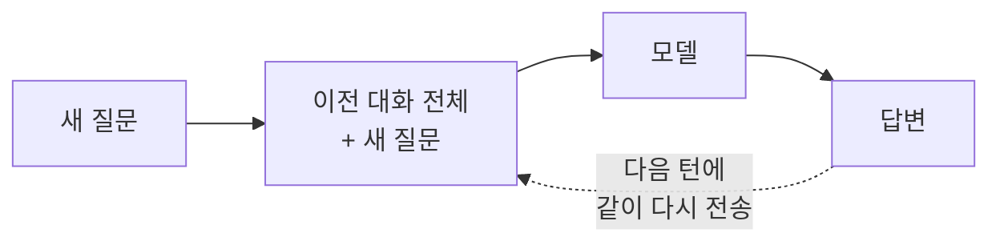
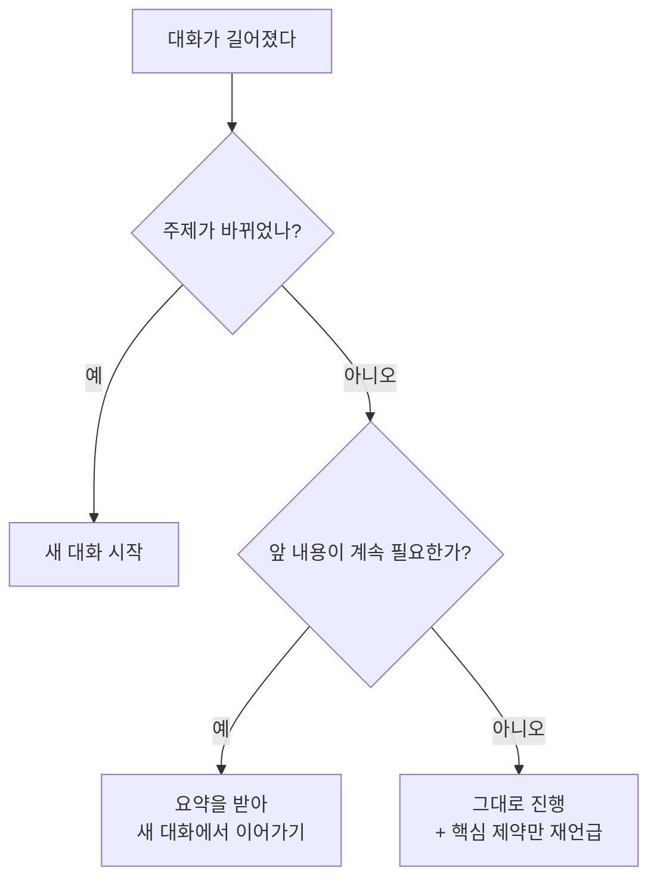

AI와 긴 대화를 하다 보면 앞에서 분명히 알려준 내용을 잊어버리는 경우를 겪게 됩니다.

"아까 말씀드린 파일 형식으로 다시 해주세요"라고 했는데 엉뚱한 답이 돌아오는 상황입니다.

이건 모델이 게을러서가 아니라 구조적인 이유가 있으며, 그 이유를 알면 대처 방법도 명확해집니다.

## 컨텍스트 윈도우란

컨텍스트 윈도우는 모델이 **한 번의 요청에서 한꺼번에 볼 수 있는 토큰의 총량**입니다.

사람으로 치면 장기 기억이 아니라, 책상 위에 한 번에 펼쳐놓을 수 있는 종이의 넓이에 가깝습니다.

{: .align-center}*컨텍스트 윈도우 하나에 입력과 출력이 모두 들어갑니다*

## 매 요청마다 대화 전체를 다시 보냅니다

여기서 가장 중요한 사실은 LLM API가 기본적으로 **상태를 저장하지 않는다(stateless)**는 점입니다.

우리 눈에는 대화가 이어지는 것처럼 보이지만, 실제로는 매번 이전 대화 전체를 다시 통째로 보내고 있습니다.

> 모델에게 기억이 있는 게 아니라, 우리가 매번 기억을 통째로 다시 들려주고 있는 구조입니다.
{: .prompt-info }

그래서 턴이 쌓일수록 매 요청의 크기가 계속 커지고, 결국 책상 넓이를 넘기게 됩니다.

{: .align-center}*턴이 늘수록 이미 보낸 내용까지 매번 다시 실려 갑니다*

## 무엇이 자리를 차지하나

컨텍스트를 채우는 건 내가 방금 친 질문만이 아닙니다.

| 구성 요소 | 설명 | 통제 가능성 |
|---|---|---|
| 시스템 프롬프트 | 역할·규칙 설정. 매 요청 고정으로 들어감 | 높음 — 짧게 유지 가능 |
| 대화 기록 | 지금까지의 질문과 답변 전부 | 높음 — 새 대화·요약으로 조절 |
| 첨부 파일 | 붙여넣은 문서·코드·이미지 | 높음 — 필요한 부분만 첨부 |
| 생각(thinking) | 답변 전 모델이 내부적으로 추론하는 과정 | 낮음 — 설정으로만 조절 |
| 답변 | 모델이 생성할 출력 | 중간 — 길이 지시로 조절 |

주목할 부분은 마지막 두 줄입니다.

컨텍스트 윈도우는 입력만의 한도가 아니라 **출력까지 포함한 하나의 예산**이며, 최근 모델은 답변 전에 내부적으로 생각하는 과정도 이 예산에서 씁니다.

> 출력 한도를 빠듯하게 잡아두면, 생각하는 데 예산을 쓰다가 정작 답변이 중간에서 잘립니다.
{: .prompt-warning }

## 한계를 넘으면 어떤 일이 일어나나

한도를 넘겼을 때의 동작은 사용하는 방식에 따라 크게 다릅니다.

| | API 직접 호출 | 챗봇 서비스 |
|---|---|---|
| 동작 | 오류로 거부되거나 응답이 끊김 | 앞부분을 자동 요약·삭제 후 계속 진행 |
| 사용자 인지 | 명시적인 오류/사유가 돌아옴 | **아무 표시 없음** |
| 체감 | 바로 알아차림 | "왜 아까 말한 걸 잊었지?" |

> 챗봇에서 앞의 내용을 잊는 건 버그가 아니라, 대화를 끊지 않으려고 조용히 잘라낸 결과입니다.
{: .prompt-warning }

## 길다고 항상 좋은 건 아닙니다

요즘 주요 모델들은 100만 토큰 규모의 컨텍스트를 제공하고, 가벼운 모델도 20만 토큰 정도를 지원합니다.

숫자만 보면 이제 다 넣어도 될 것 같지만, 실무에서는 두 가지 이유로 그렇지 않습니다.

첫째는 **비용**입니다. 요금은 토큰 단위로 매겨지므로, 매 요청마다 30만 토큰짜리 대화 기록을 다시 보내면 그만큼 매번 청구됩니다.

둘째는 **품질**입니다. 관련 없는 내용이 잔뜩 섞여 있으면 정작 중요한 지시가 그 안에 묻힙니다.

최근 업계에서 프롬프트 엔지니어링을 넘어 **컨텍스트 엔지니어링**이라는 말이 쓰이는 것도 이 때문입니다.

문장을 다듬는 문제가 아니라, 한정된 창에 무엇을 넣고 무엇을 뺄지 설계하는 문제로 옮겨간 것입니다.

## 실전 대처법

상황별로 쓸 수 있는 방법은 이렇게 정리됩니다.

| 상황 | 방법 | 효과 |
|---|---|---|
| 주제가 바뀜 | 새 대화 시작 | 관련 없는 기록 제거 + 비용 절감 |
| 대화가 길어짐 | "지금까지 결정된 사항 정리해줘" 후 새 대화에서 시작 | 핵심만 남기고 부피 축소 |
| 중요한 제약이 있음 | 최근 메시지에서 한 번 더 언급 | 잘려나갔어도 복구됨 |
| 매번 같은 설명 반복 | 프로젝트 규칙 파일로 고정 | 대화 낭비 제거 |

판단이 애매할 때는 이 순서로 생각하면 됩니다.

## 토큰 수를 정확히 세려면

내 프롬프트가 몇 토큰인지 미리 확인하고 싶다면, 실제로 호출할 모델이 제공하는 토큰 카운트 기능을 쓰는 것이 정확합니다.

여기서 흔한 실수가 하나 있는데, 파이썬의 `tiktoken` 라이브러리로 세는 경우입니다.

> `tiktoken`은 **OpenAI 모델용** 토크나이저입니다. 다른 모델에는 맞지 않고, 특히 한글이나 코드에서 오차가 크게 벌어집니다.
> 토크나이저는 모델마다 다르므로, 쓰려는 모델의 카운트 기능을 그대로 쓰는 것이 유일하게 안전한 방법입니다.
{: .prompt-tip }

컨텍스트 윈도우는 결국 "얼마나 많이 넣을 수 있나"보다 "무엇을 남길 것인가"의 문제이며, 이 관점만 잡아두어도 대화 품질과 비용이 함께 좋아집니다.

## 참고

- [Context Windows — Anthropic 공식 문서](https://platform.claude.com/docs/en/build-with-claude/context-windows) — 컨텍스트 계산 방식과 모델별 한도
- [The Missing Memory Hierarchy: Demand Paging for LLM Context Windows](https://arxiv.org/abs/2603.09023) (2026-03) — 컨텍스트 윈도우를 CPU 캐시에 빗대어 다루는 관점
- [TokenPilot: Cache-Efficient Context Management for LLM Agents](https://arxiv.org/abs/2606.17016) (2026-06) — 긴 세션에서 컨텍스트를 정리해 비용을 줄이는 방법
- [dair-ai/Prompt-Engineering-Guide](https://github.com/dair-ai/Prompt-Engineering-Guide) — 프롬프트·컨텍스트 관련 기법 정리
