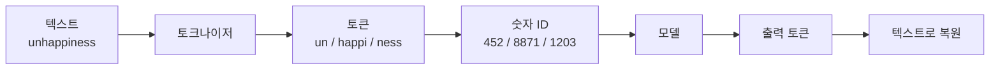
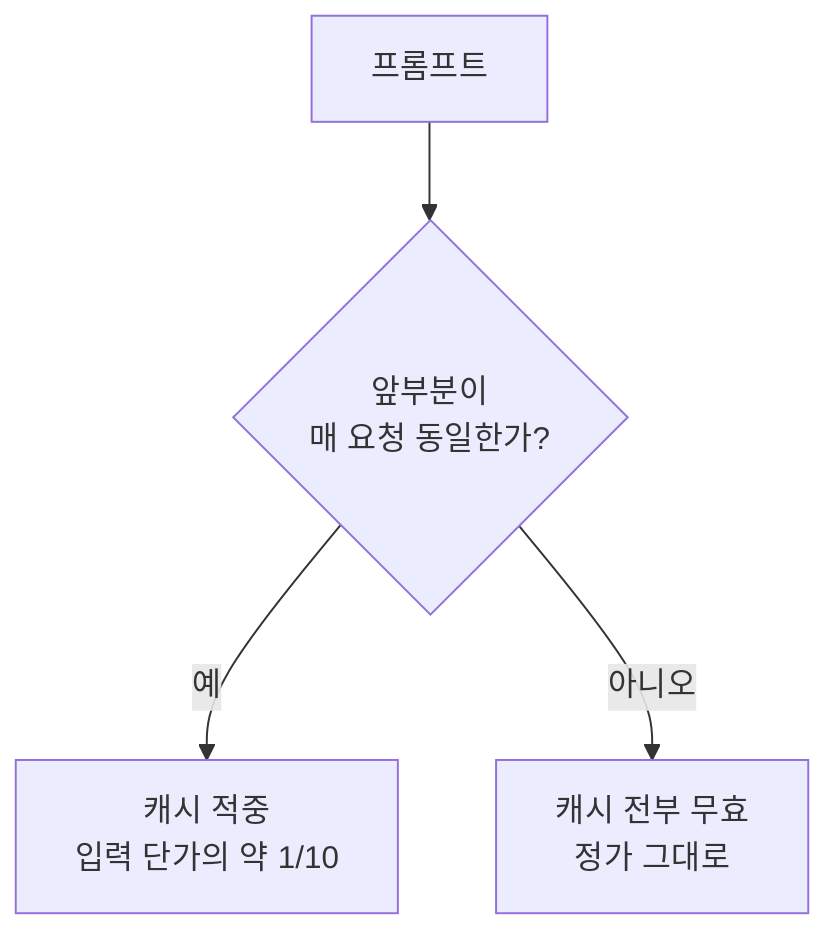

LLM을 쓰다 보면 요금도 토큰, 한도도 토큰, 속도도 토큰 기준으로 이야기합니다.

그런데 정작 "토큰이 몇 글자인가요?"라고 물으면 명확한 답이 없습니다.

토큰은 글자 수도 단어 수도 아닌 별도의 단위이고, 이 차이를 알아야 비용 계산과 한도 관리가 맞아떨어집니다.

## 토큰은 글자도 단어도 아닙니다

모델은 텍스트를 통째로 읽지 못하고, 정해진 조각으로 잘라서 숫자로 바꾼 뒤에야 처리합니다.

이때 자르는 방식에는 세 가지 선택지가 있습니다.

{: .align-center}*같은 단어라도 자르는 기준에 따라 조각 수가 크게 달라집니다*

| 방식 | 조각 종류 | 문장 길이 | 처음 보는 단어 |
|---|---|---|---|
| 글자 단위 | 매우 적음 | 매우 길어짐 | 처리 가능 |
| 단어 단위 | 매우 많음 | 짧음 | **처리 불가** |
| 서브워드 | 적당 | 적당 | 조합해서 처리 |

현대 LLM이 쓰는 것은 세 번째인 **서브워드(subword)** 방식입니다.

자주 나오는 단어는 통째로 한 조각이 되고, 드문 단어는 여러 조각으로 쪼개서 표현하는 절충안입니다.

이 아이디어는 2015년 기계번역 연구에서 나왔고, 지금은 사실상 모든 언어 모델의 기본이 되었습니다.

## 텍스트가 모델에 들어가기까지

토큰은 최종 형태가 아니라 중간 단계입니다.

모델이 실제로 다루는 건 숫자이고, 우리가 보는 글자는 양 끝에서만 존재합니다.

> 요금, 컨텍스트 한도, 생성 속도가 모두 토큰을 기준으로 매겨지는 것도 이 때문입니다. 모델 입장에서 텍스트의 실제 크기는 글자 수가 아니라 토큰 수입니다.
{: .prompt-info }

## 한글이 토큰을 더 많이 먹습니다

같은 뜻의 문장이라도 한글이 영어보다 토큰을 더 많이 소모하는 경향이 있습니다.

토크나이저는 학습 데이터에 자주 등장한 조각을 통째로 한 토큰에 배정하는데, 학습 데이터에서 영어의 비중이 압도적으로 크기 때문입니다.

그래서 흔한 영어 단어는 통째로 1토큰이 되는 반면, 한글은 더 잘게 쪼개져 여러 토큰을 차지하게 됩니다.

실무에서 이게 의미하는 바는 분명합니다.

같은 분량의 문서라도 **한글 문서가 영어 문서보다 비용이 더 나오고 컨텍스트도 더 빨리 채웁니다.**

## 토큰이 좌우하는 세 가지

| 항목 | 토큰과의 관계 | 실무에서 체감 |
|---|---|---|
| 비용 | 입력·출력 토큰 수로 과금 | 긴 대화를 반복하면 요금이 누적 |
| 컨텍스트 한도 | 한도 자체가 토큰 단위 | 한도를 넘으면 앞부분이 잘림 |
| 생성 속도 | 토큰을 하나씩 순차 생성 | 답변이 길수록 오래 걸림 |

컨텍스트 한도가 왜 문제가 되는지는 [컨텍스트 윈도우 편](/posts/context-window/)에서 자세히 다뤘습니다.

## 토큰을 아끼는 여섯 가지 방법

토큰 수를 줄이면 비용과 속도가 함께 좋아집니다.

효과가 큰 순서대로 정리했습니다.

| 방법 | 무엇을 하나 | 효과 |
|---|---|---|
| 프롬프트 캐싱 | 반복되는 긴 지시·문서를 캐시에 올려두고 재사용 | 캐시 적중분은 입력 단가의 약 1/10 |
| 배치 처리 | 급하지 않은 작업을 배치 엔드포인트로 | 약 50% 할인 |
| 출력 길이 제어 | 답변 형식·분량을 명시 | 출력 단가가 입력보다 비싸 효율이 큼 |
| 대화 정리 | 요약 후 새 대화로 이어가기 | 매 턴 재전송량 감소 |
| 프롬프트 압축 | 의미를 유지하며 프롬프트를 줄이는 도구 사용 | 사례에 따라 수 배 |
| 모델 라우팅 | 쉬운 작업은 작은 모델로 | 작업 난이도에 맞는 단가 |

**출력 길이 제어**가 특히 저평가되어 있습니다.

대부분의 모델은 출력 토큰이 입력 토큰보다 몇 배 비싸기 때문에, 답변을 짧게 만드는 쪽이 입력을 줄이는 것보다 효율이 좋은 경우가 많습니다.

"표로만 답해줘", "설명 없이 코드만" 같은 한 줄 지시가 실제 비용에 바로 반영됩니다.

**프롬프트 캐싱**은 도입 비용 대비 효과가 가장 크지만, 조용히 무력화되기 쉽습니다.

> 캐싱은 **앞에서부터 정확히 일치하는 부분**까지만 재사용됩니다. 시스템 프롬프트 맨 앞에 현재 시각이나 요청 ID 같은 매번 바뀌는 값을 끼워 넣으면, 그 뒤 전체가 캐시에서 빠집니다.
> 고정된 내용을 앞에, 매번 바뀌는 내용을 뒤에 두는 것만으로 캐시 적중률이 달라집니다.
{: .prompt-tip }

캐시에도 유지 비용이 있어서 쓰는 시점에 요금이 조금 더 붙습니다. 같은 내용을 두 번 이상 재사용할 때부터 이득이라고 보면 됩니다.

**프롬프트 압축**은 도구의 도움을 받는 방법입니다.

Microsoft의 [LLMLingua](https://github.com/microsoft/LLMLingua)는 중요도가 낮은 토큰을 걸러내 프롬프트를 줄이는 연구로, 논문에서는 최대 20배 압축에도 성능 손실이 크지 않다고 보고합니다.

다만 압축은 손실이 있는 방식이므로, 정확도가 중요한 작업에서는 먼저 캐싱과 출력 제어부터 적용하는 편이 안전합니다.

> 인터넷에는 "토큰 80% 절감" 같은 수치를 내세운 도구가 많습니다. 스타 수와 최근 커밋을 먼저 확인하세요. 검색 상위에 뜬다고 검증된 도구는 아닙니다.
{: .prompt-warning }

## 같은 글도 모델이 바뀌면 토큰 수가 달라집니다

여기서 놓치기 쉬운 부분이 있습니다.

토크나이저는 모델에 딸린 부품이라서, **모델이 바뀌면 같은 텍스트의 토큰 수도 바뀝니다.**

실제로 Anthropic은 Sonnet 4.6에서 Sonnet 5로 넘어갈 때 같은 텍스트가 약 30% 더 많은 토큰으로 계산된다고 마이그레이션 문서에 명시하고 있습니다.

토큰당 단가가 같아도 토큰 수가 늘면 실제 비용은 올라가고, 넉넉했던 출력 한도가 갑자기 모자라 답변이 잘리기도 합니다.

> 모델 버전을 올릴 때는 **같은 프롬프트로 토큰 수를 다시 측정**하세요. 예전 모델에서 잰 값을 그대로 쓰면 비용 예측과 한도 설정이 어긋납니다.
{: .prompt-warning }

## 정확히 세는 법

토큰 수를 어림잡는 공식(예: "영어 1토큰 ≈ 4글자")이 돌아다니지만, 언어와 내용에 따라 오차가 큽니다.

정확한 값이 필요하다면 **실제로 호출할 모델이 제공하는 토큰 카운트 기능**을 쓰는 것이 유일한 방법입니다.

> 파이썬의 `tiktoken`은 OpenAI 모델용 토크나이저라 다른 모델에는 맞지 않습니다. 특히 한글과 코드에서 오차가 크게 벌어지므로, 쓰려는 모델의 카운트 기능을 그대로 쓰는 편이 안전합니다.
{: .prompt-tip }

정리하면 토큰은 모델이 세상을 보는 최소 단위이고, 요금·한도·속도가 모두 여기에 묶여 있습니다.

글자 수 대신 토큰 수로 생각하는 습관을 들이면, 비용이 튀는 지점과 한도가 새는 지점이 훨씬 먼저 보입니다.

## 참고

- [Token Counting — Anthropic 공식 문서](https://platform.claude.com/docs/en/build-with-claude/token-counting) — 요청 전에 토큰 수를 재는 방법
- [Prompt Caching — Anthropic 공식 문서](https://platform.claude.com/docs/en/build-with-claude/prompt-caching) — 캐시 적중 조건과 요금 구조
- [Batch Processing — Anthropic 공식 문서](https://platform.claude.com/docs/en/build-with-claude/batch-processing) — 배치 엔드포인트와 할인
- [Neural Machine Translation of Rare Words with Subword Units](https://arxiv.org/abs/1508.07909) (Sennrich 외, 2015) — 서브워드 분할(BPE)을 제안한 원논문
- [LLMLingua: Compressing Prompts for Accelerated Inference of LLMs](https://arxiv.org/abs/2310.05736) (Jiang 외, EMNLP 2023) — 프롬프트 압축 원논문
- [microsoft/LLMLingua](https://github.com/microsoft/LLMLingua) — 위 논문의 공식 구현체 (2026-08-09 기준 ★6,533)
- [dair-ai/Prompt-Engineering-Guide](https://github.com/dair-ai/Prompt-Engineering-Guide) — 토큰·프롬프트 관련 기법 정리
