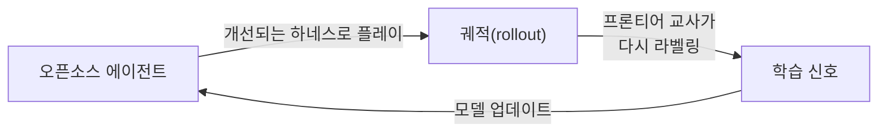

앞선 [Prime Agent 리뷰](/posts/prime-agent/)에서 `/refine` 기능을 봤습니다. 에이전트가 자기 하네스를 스스로 고치는 기능입니다.

그게 어디서 나온 아이디어인지 궁금했는데, 근거가 되는 논문이 함께 나와 있었습니다.

오늘은 그 논문을 봅니다 — [Continual Harness: Online Adaptation for Self-Improving Foundation Agents](https://arxiv.org/abs/2605.09998) (Karten 외, 2026-05, 28쪽).

## 하네스가 뭐길래

논문은 첫 문장부터 문제를 정의합니다.

> Claude Code나 OpenHands 같은 **코딩 하네스**는 파운데이션 모델을 도구·메모리·플래닝으로 감싸준다. 그런데 **몸을 가진(embodied) 에이전트**의 장기 지평·부분 관측 의사결정에는 그런 게 없다.

여기서 **하네스(harness)**란 모델 자체가 아니라 **모델을 감싸는 것 전부**입니다. 시스템 프롬프트, 쓸 수 있는 도구, 메모리, 서브에이전트 구성 같은 것들입니다.

같은 모델이라도 하네스가 좋으면 훨씬 잘합니다. 문제는 그 하네스를 **지금까지 사람이 만들고 사람이 고쳐왔다**는 점입니다.

## 사람이 하네스를 고치던 시절

논문은 자기들의 이전 작업부터 보고합니다. **Gemini Plays Pokemon(GPP)** 입니다.

사람이 붙어서 하네스를 반복적으로 다듬은 결과, GPP는 포켓몬 **Blue**, **Yellow Legacy 하드모드**, **Crystal**을 클리어했습니다. 그것도 **한 번의 배틀도 지지 않고** 끝낸 최초의 AI 시스템이라고 보고합니다.

인상적이지만, 뒤집어 보면 **사람이 계속 붙어 있어야 했다**는 뜻이기도 합니다.

## 그런데 에이전트가 스스로 고치기 시작했다

여기서 논문의 출발점이 된 관찰이 나옵니다.

가장 어려운 구간에서, **에이전트가 긴 컨텍스트 메모리를 활용해 스스로 전략을 다듬기 시작**했습니다. 사람이 시킨 게 아니라 저절로 나타난 자기개선 신호였습니다.

Continual Harness는 이 우연한 관찰을 **형식화하고 자동화한 것**입니다. 사람을 루프에서 완전히 빼는 게 목표입니다.

## 사람도, 리셋도 없이

{: .align-center}*왼쪽이 지금까지의 방식, 오른쪽이 논문이 제안하는 방식입니다*

에이전트는 **최소한의 환경 인터페이스만 주어진 상태에서 시작**합니다. 큐레이션된 공략 지식도, 사람이 만든 도구도, 도메인 전용 스캐폴딩도 없습니다.

그리고 **행동하기**와 **자기 하네스 고치기**를 번갈아 합니다. 고치는 대상은 넷입니다.

| 대상 | 무엇을 바꾸나 |
|---|---|
| 프롬프트 | 자기 자신에게 주는 지시 |
| 서브에이전트 | 어떤 하위 작업을 누구에게 맡길지 |
| 스킬 | 반복 작업을 재사용 가능한 형태로 |
| 메모리 | 무엇을 기억하고 무엇을 버릴지 |

수정의 근거로는 **지금까지 쌓인 모든 궤적 데이터**를 씁니다.

## 핵심은 "리셋이 없다"는 것

이 논문에서 가장 중요한 단어는 **reset-free**입니다.

기존 프롬프트 최적화 방법들은 대부분 이렇게 동작합니다. 한 판 해보고 → 결과를 보고 프롬프트를 고치고 → **처음부터 다시** 해봅니다.

Continual Harness는 **한 번의 실행 안에서 온라인으로** 적응합니다.

| | 기존 프롬프트 최적화 | Continual Harness |
|---|---|---|
| 개선 시점 | 에피소드가 끝난 뒤 | 실행 도중 계속 |
| 리셋 | 필요 | 불필요 |
| 개선 주체 | 대체로 사람 또는 외부 루프 | 에이전트 자신 |

> 이게 왜 중요한가 하면, **현실의 장기 작업에는 리셋 버튼이 없기 때문**입니다. 며칠짜리 마이그레이션을 돌리는 에이전트에게 "처음부터 다시 해보자"는 선택지가 없습니다.
{: .prompt-info }

## 결과

포켓몬 **Red**와 **Emerald**에서, 여러 프론티어 모델을 놓고 평가했습니다.

측정 지표는 **버튼 입력 비용(button-press cost)** 입니다. 게임을 진행하는 데 얼마나 많은 조작이 필요했는가입니다.

- 맨바닥에서 시작한 Continual Harness가 **최소 기능 베이스라인 대비 버튼 입력 비용을 크게 줄였습니다**
- 사람이 손으로 만든 **전문가 하네스와의 격차를 과반 회복**했습니다
- 다만 **이득 폭은 모델의 능력에 따라 달라집니다**

큐레이션된 지식도 수제 도구도 없이, 같은 원시 인터페이스에서 출발해 저 정도까지 왔다는 게 논문의 주장입니다.

## 모델까지 같이 학습시킨다

마지막에 한 걸음 더 나갑니다. 하네스만 고치는 게 아니라 **모델 자체도 같이 학습**시킵니다.

오픈소스 에이전트가 만들어낸 궤적을 프론티어 모델이 교사 역할로 다시 라벨링하고, 그걸로 모델을 갱신합니다. 논문은 이를 **process-reward co-learning**이라고 부릅니다.

여기서도 **환경을 리셋하지 않고** 포켓몬 Red의 게임 내 마일스톤 진행이 지속적으로 이어졌다고 보고합니다.

## 왜 하필 포켓몬인가

장난스러워 보이지만 벤치마크로서는 조건이 까다롭습니다.

- **부분 관측** — 화면에 보이는 것만으로 판단해야 합니다
- **장기 지평** — 클리어까지 수만 번의 조작이 필요합니다
- **사실상 리셋 불가** — 진행을 되돌리기 어렵고, 되돌리면 의미가 없습니다

코딩 벤치마크가 대체로 "한 문제 풀고 채점"인 것과 달리, **길게 이어지는 상태를 계속 끌고 가야 하는** 과제입니다. 논문이 말하는 embodied·장기 지평 문제의 성격을 그대로 갖고 있습니다.

## Prime Agent와 이어서 보면

이 논문과 [Prime Agent](/posts/prime-agent/)를 나란히 놓으면 그림이 완성됩니다.

| | 논문 | Prime Agent |
|---|---|---|
| 무대 | 포켓몬 (embodied) | 코딩·리서치 |
| 고치는 대상 | 프롬프트 · 서브에이전트 · 스킬 · 메모리 | 보조 프롬프트 · 서브에이전트 명세 · 스킬 설명 · 메모리 |
| 실행 방식 | 행동 ↔ 개선 교대 | `/refine` 명령 |
| 안전장치 | — | 기본 시스템 프롬프트 불변 + 스냅샷 롤백 |

고치는 대상 네 가지가 그대로 겹칩니다. **논문의 아이디어가 실제 도구로 구현된 것**이 Prime Agent의 `/refine`인 셈입니다.

제품 쪽에 안전장치가 하나 더 붙은 점도 눈여겨볼 만합니다. 논문은 성능을 보이는 게 목적이지만, 사람이 쓰는 도구는 **되돌릴 수 있어야** 하니까요.

## 정리

하네스 엔지니어링은 지금까지 **사람의 감각과 반복 노동**에 기대는 영역이었습니다. 좋은 시스템 프롬프트를 쓰고, 도구를 다듬고, 메모리 구조를 손보는 일 전부가 그렇습니다.

이 논문은 그 일을 **에이전트에게 넘길 수 있는가**를 묻고, 포켓몬이라는 까다로운 무대에서 "상당 부분 넘길 수 있다"는 답을 내놓습니다.

전문가 하네스를 완전히 대체하지는 못했습니다. 격차의 과반을 회복했을 뿐이고 모델 능력에 따라 편차도 있습니다. 그래도 **아무 지식 없이 시작해서 거기까지 갔다**는 점이 이 논문의 무게입니다.

## 참고

- [Continual Harness: Online Adaptation for Self-Improving Foundation Agents](https://arxiv.org/abs/2605.09998) — Karten 외, 2026-05, 28쪽 / 그림 19 / 표 5 (cs.LG, cs.AI)
- [PrimeIntellect-ai/prime-agent](https://github.com/PrimeIntellect-ai/prime-agent) — 이 아이디어를 `/refine` 으로 구현한 오픈소스 에이전트
- [Prime Agent 뜯어보기](/posts/prime-agent/) — 같은 주제의 앞 글
