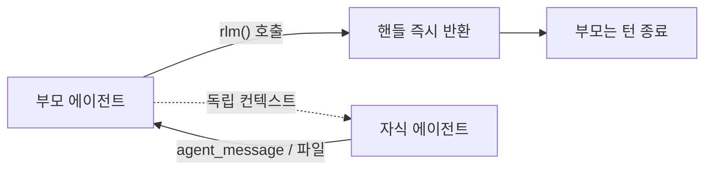

코딩 에이전트는 이제 흔합니다.

그래서 새로 나온 것을 볼 때는 "무엇을 할 수 있나"보다 "**어떻게 설계했나**"를 보는 편이 남는 게 많습니다.

오늘 볼 [Prime Agent](https://github.com/PrimeIntellect-ai/prime-agent)는 그 점에서 특이합니다. 널리 쓰이는 방식과 거의 모든 선택이 반대입니다.

## 무엇인가

분산 학습으로 알려진 Prime Intellect가 만든 오픈소스 코딩·리서치 에이전트입니다.

| 항목 | 값 (2026-08-10 기준) |
|---|---|
| 스타 / 포크 | ★11,365 / 1,166 |
| 언어 · 라이선스 | TypeScript · MIT |
| 시작 | 2026-05-08 |
| 열린 이슈 | 451개 |

3개월 만에 1만 스타를 넘겼고 지금도 매일 커밋이 올라옵니다. 대신 이슈가 451개 열려 있어 아직 다듬어지는 중입니다.

## 도구가 하나뿐이다

가장 큰 차이는 여기입니다.

보통의 코딩 에이전트는 능력마다 도구를 하나씩 정의합니다. 파일을 읽는 도구, 쓰는 도구, 셸을 실행하는 도구, 검색하는 도구가 따로 있습니다.

Prime Agent는 **내장 도구가 `ipython` 하나**입니다.

{: .align-center}*능력마다 도구를 두는 대신, 파이썬 커널 하나를 주고 그 안에서 다 하게 합니다*

파일을 찾는 것도 그냥 파이썬입니다.

```python
config_files = list(Path(".").rglob("*.toml"))
large_files = [p for p in config_files if p.stat().st_size > 10_000]
```

프로젝트 명령어는 셀 매직으로 실행합니다.

```python
%%bash
npm run check
```

이 방식의 이점은 **조합**입니다. 파일 목록을 뽑아 필터링하고 그 결과로 다시 뭔가를 하는 작업이, 도구 호출 세 번이 아니라 코드 한 덩어리로 끝납니다. 중간 결과가 매번 모델을 거쳐 돌아오지 않습니다.

## 컨텍스트를 대화가 아니라 변수에 둔다

여기서 더 중요한 성질이 나옵니다.

파이썬 커널이 **영속**합니다. 변수·import·파싱 결과가 턴을 넘어 살아있고, **컨텍스트 압축을 거쳐도 유지**됩니다.

> [컨텍스트 윈도우 편](/posts/context-window/)에서 다룬 문제를 정면으로 다르게 푸는 접근입니다. 대화가 길어지면 요약해서 버티는 대신, **애초에 대화에 안 쌓고 변수에 담아 밖에 둡니다.**
{: .prompt-info }

10만 줄짜리 로그를 분석한다면, 일반적인 방식은 그 내용이 어떤 형태로든 대화에 들어옵니다. RLM 방식에서는 `df`라는 변수에 담기고 모델은 `df.shape`만 봅니다. 필요할 때 다시 꺼내 쓰면 됩니다.

Prime Intellect는 이걸 **prompt-as-a-variable**이라고 부릅니다.

## 서브에이전트가 답을 돌려주지 않는다

서브에이전트도 함수 호출입니다.

```python
handle = await rlm("Review the authentication flow", name="auth-reviewer")
```

설계에서 가장 눈여겨볼 부분은 **이 호출이 결과를 기다리지 않는다**는 점입니다. 즉시 핸들만 돌려주고 끝납니다. 자식의 답은 `agent_message`나 파일로만 옵니다.



번거로워 보이지만 의도가 분명합니다. **자식이 읽은 수천 줄이 부모 컨텍스트로 역류하지 않습니다.** 서브에이전트를 썼는데 부모 컨텍스트가 같이 터지는 문제를 구조로 막은 것입니다.

여러 자식을 동시에 띄우고 턴을 끝내는 것도 자연스럽습니다.

```python
api_review = await rlm("Review the public API", name="api-reviewer")
test_review = await rlm("Review the test coverage", name="test-reviewer")
```

## 하네스를 에이전트가 스스로 고친다

두 번째 축은 **Continual Harness**입니다. 논문도 함께 나왔습니다 — [Continual Harness: Online Adaptation for Self-Improving Foundation Agents](https://arxiv.org/abs/2605.09998) (Karten 외, 2026-05).

여기서 하네스란 모델을 감싸는 것 전부를 말합니다. 시스템 프롬프트, 메모리, 스킬 설명, 서브에이전트 명세 같은 것들입니다. 보통은 사람이 만들고 사람이 고칩니다.

Prime Agent는 `/refine` 명령으로 **에이전트가 자기 하네스를 고치게** 합니다. 지금까지의 작업을 돌아보고, 근거가 있는 작은 수정을 하네스에 반영합니다.

안전장치가 둘 있습니다.

- **기본 시스템 프롬프트는 절대 건드리지 않습니다.** 수정 대상은 그 위에 얹히는 보조 상태뿐입니다
- 변경 이력을 스냅샷으로 남겨 **롤백**할 수 있습니다

논문 실험이 포켓몬인 게 재미있습니다. 최소한의 인터페이스 명세만 주고 시작해도, **사람이 손으로 튜닝한 하네스 성능의 대부분을 자동으로 회복**했다고 보고합니다.

> 이 논문은 따로 한 편으로 다루겠습니다. 하네스 엔지니어링이라는 개념 자체를 이해하는 데 좋은 사례라서요.
{: .prompt-tip }

## 터미널을 닫아도 계속 돈다

장기 실행을 전제로 설계된 티가 납니다.

| 기능 | 내용 |
|---|---|
| 데몬 기반 세션 | 터미널이 끊겨도 계속 실행, 나중에 재접속 |
| 하트비트 · 스케줄 | 주기적으로 또는 지정 시각에 세션 재진입 |
| `/goal` | 목표와 진행 상황을 턴을 넘어 유지 |
| `/autonomous` | 턴 · 토큰 · 시간 예산 안에서 자율 실행 |

여기서 문서가 솔직하게 적어둔 부분이 있습니다. **품질 게이트를 통과했다는 건 그 게이트가 검사한 것만 통과했다는 뜻이고, 예산 한도에 도달한 것이 작업 성공을 의미하지는 않습니다.** 자율 실행을 파는 도구가 이런 단서를 스스로 다는 경우는 드뭅니다.

## 쓰기 전에 알아야 할 것

**Linux와 macOS만 지원합니다.** 문서 어디에도 Windows 언급이 없습니다. Windows에서 쓰시려면 WSL을 거쳐야 합니다.

```bash
curl -fsSL https://app.primeintellect.ai/prime-agent/install.sh | sh
```

그리고 README가 스스로 굵게 경고하는 부분이 있습니다.

> Prime Agent는 모델이 생성한 파이썬과 프로젝트 명령을 **사용자 권한 그대로** 실행합니다. worker와 kernel 프로세스를 나눈 것은 수명주기 격리와 복구를 위한 것이지 **보안 샌드박스가 아닙니다.**
{: .prompt-danger }

도구가 `ipython` 하나라는 설계는 유연한 만큼 실행 범위도 넓습니다. 신뢰할 수 있는 저장소에서, 되돌릴 수 있는 작업 폴더에서 쓰는 게 맞습니다.

## 정리

| | 일반적인 에이전트 | Prime Agent |
|---|---|---|
| 도구 | 능력마다 하나씩 | `ipython` 하나 |
| 컨텍스트 | 대화에 쌓임 → 압축 | 변수에 담아 밖에 보관 |
| 서브에이전트 | 결과를 기다려 받음 | 핸들만 받고 비동기 |
| 하네스 | 사람이 만들고 고정 | 에이전트가 스스로 개선 |
| 실행 범위 | 도구별로 제한 | 파이썬이 되는 만큼 전부 |

마지막 줄이 이 설계의 요약입니다. **유연함과 통제를 맞바꾼 구조**입니다.

당장 주력 도구를 갈아탈 이유는 크지 않습니다. 이슈가 451개고 Windows도 안 됩니다. 다만 "에이전트에게 무엇을 쥐여줄 것인가"라는 질문에 이렇게 다른 답이 가능하다는 걸 보여주는 사례로는 충분히 볼 만합니다.

## 참고

- [PrimeIntellect-ai/prime-agent](https://github.com/PrimeIntellect-ai/prime-agent) — 본체 저장소 (MIT)
- [Recursive Language Model (RLM)](https://www.primeintellect.ai/blog/rlm) — RLM 개념을 설명한 공식 글
- [Continual Harness: Online Adaptation for Self-Improving Foundation Agents](https://arxiv.org/abs/2605.09998) (Karten 외, 2026-05) — 하네스 자기개선 논문
- [earendil-works/pi](https://github.com/earendil-works/pi) — Prime Agent가 기반으로 삼은 에이전트 툴킷
