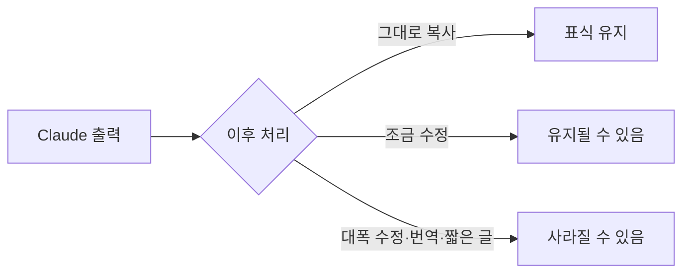

2026년 8월 11일, Anthropic이 **Claude가 만든 텍스트에 보이지 않는 워터마크를 심는다**고 발표했습니다.

국내에서는 스레드 [@choi.openai](https://www.threads.com/@choi.openai)가 정리한 글로 크게 돌았습니다. 반응이 컸던 이유가 분명한데, "이제 AI가 쓴 글을 걸러낼 수 있다"로 읽히기 때문입니다.

그런데 [공식 문서](https://support.claude.com/en/articles/16266773-how-claude-marks-ai-generated-content)를 직접 읽어보면 **그렇게 쓰라고 만든 기능이 아닙니다.** 오히려 문서가 스스로 한계를 여러 번 못박고 있습니다.

## 무엇이 바뀌었나

사실 관계부터 정리하면 이렇습니다.

| 항목 | 내용 |
|---|---|
| 발표 | 2026-08-11 |
| 적용 대상 | Claude Platform(API), Claude, Claude Code, Claude Cowork, Claude Tag |
| 적용 범위 | **전 세계** — Claude가 제공되는 모든 곳 |
| 계기 | EU AI Act 50조 (2026-08-02 시행) |

주목할 부분은 **적용 범위**입니다. 규제는 유럽 것인데 표식은 사용자 위치와 무관하게 붙습니다. 한국에서 써도 예외가 아닙니다.

## 두 가지 방식

텍스트와 파일이 다르게 처리됩니다.

| 대상 | 방식 |
|---|---|
| 텍스트 | 눈에 보이지 않는 워터마크를 **글 자체에 짜 넣음** |
| 파일 (`.svg` `.png` `.jpg`) | **C2PA** 표준의 서명된 출처 메타데이터를 첨부 |

텍스트 워터마크는 메타데이터가 아니라 **본문에 섞여 들어갑니다.** 그래서 복사해서 다른 곳에 붙여넣어도 따라갑니다. 문서는 이것이 의미·가독성·문체·품질에 영향을 주지 않도록 설계됐다고 밝히고 있습니다.

## 여기서부터가 중요합니다

공식 문서의 표현을 그대로 옮기면, 표식이 검출되어도 그것은 **"단정적이지 않다(not fully conclusive)"**고 합니다.

> 표식은 해당 내용이 **Claude를 거쳤을 수 있다는 신호**일 뿐이며, 콘텐츠의 완전한 출처를 확인해주지는 않는다.
{: .prompt-warning }

문서가 직접 드는 이유가 둘입니다.

- Claude가 **원저자가 아닐 수 있습니다.** 번역이나 요약을 시켰을 수도 있습니다
- Claude를 거친 뒤 **수정·발췌되거나 다른 글과 섞였을 수 있습니다**

즉 표식이 답하는 질문은 "누가 썼는가"가 아니라 **"이 글이 Claude를 거쳤는가"**입니다. 둘은 전혀 다른 질문입니다.

{: .align-center}*표식의 유무가 실제로 뜻하는 것*

②번이 실무에서 바로 문제가 됩니다. **내가 직접 쓴 글을 Claude로 맞춤법만 고쳐도 표식이 붙습니다.** 그 글은 AI가 쓴 글이 아닌데도요.

## 언제 사라지나

반대 방향의 한계도 문서에 명시돼 있습니다. 다음 경우 표식이 남지 않을 수 있습니다.

- 크게 고쳐 쓰거나(heavily edited) 바꿔 쓴(paraphrased) 경우
- 번역한 경우
- 다른 글에 섞어 넣은 경우
- **원문이 아주 짧은 경우**

마지막 항목이 특히 실용적인 한계입니다. 짧은 문장에는 표식을 심을 여지가 부족합니다.

정리하면 **양방향으로 다 틀릴 수 있습니다.** 사람이 쓴 글에 표식이 붙기도 하고, AI가 쓴 글에서 표식이 사라지기도 합니다.

## 아직 탐지 도구가 없습니다

또 하나 놓치기 쉬운 부분입니다. **지금은 표식을 확인할 방법이 공개돼 있지 않습니다.**

문서는 사용자와 제3자가 워터마크와 출처 메타데이터를 검출할 수 있게 하는 작업을 진행 중이며, 탐지 방식은 **향후 기술 문서에서 다루겠다**고만 밝히고 있습니다.

> 표식은 이미 붙고 있지만 확인할 수단은 아직 없습니다. 지금 "AI 검출기"를 표방하는 도구들이 이 워터마크를 읽는 것은 아닙니다.
{: .prompt-info }

## 실무에서 무엇이 달라지나

| 상황 | 영향 |
|---|---|
| Claude로 초안을 쓰고 그대로 제출 | 표식이 따라갑니다 |
| 직접 쓰고 Claude로 교정만 | **표식이 붙습니다** — 저자는 본인인데도 |
| Claude로 쓰고 대폭 고쳐 씀 | 표식이 사라질 수 있습니다 |
| 이미지·SVG 생성 | C2PA 메타데이터가 붙습니다 |

당장 할 일이 생기는 건 아닙니다. 다만 **"표식 = AI 작성"이라는 등식으로 사람을 판단하는 상황**은 경계해야 합니다. 학교나 회사가 이걸 근거로 삼기 시작하면, 교정에 AI를 쓴 사람이 대필로 몰릴 수 있습니다.

공식 문서가 "단정적이지 않다"고 스스로 적어둔 이유가 여기 있다고 봅니다.

## 정리

이번 발표는 **AI 판별기가 생긴 사건이 아니라, 출처 표시 의무에 대한 대응**입니다.

EU AI Act 50조는 생성형 AI의 출력물에 기계가 읽을 수 있는 표시를 요구합니다. Anthropic은 그 의무를 유럽에만 적용하는 대신 전 세계로 확대했고, 그 결과 우리도 영향을 받습니다.

기술 자체보다 **이걸 어떻게 해석하고 쓰느냐**가 앞으로의 쟁점이 될 것 같습니다.

## 참고

- [How Claude marks AI-generated content](https://support.claude.com/en/articles/16266773-how-claude-marks-ai-generated-content) — Anthropic 공식 문서 (2026-08-12 확인). 이 글의 사실관계는 전부 여기서 확인했습니다
- [Anthropic says it will watermark text generated by its AI models](https://techcrunch.com/2026/08/11/anthropic-says-it-will-watermark-text-generated-by-its-ai-models/) — TechCrunch, 2026-08-11 발표 보도
- [@choi.openai](https://www.threads.com/@choi.openai) — 이 소식을 국내에 정리해 알린 스레드 계정 (2026-08-12 확인). 이 글은 해당 게시물을 계기로 쓰였고, 사실관계는 위 1차 출처로 다시 확인했습니다
