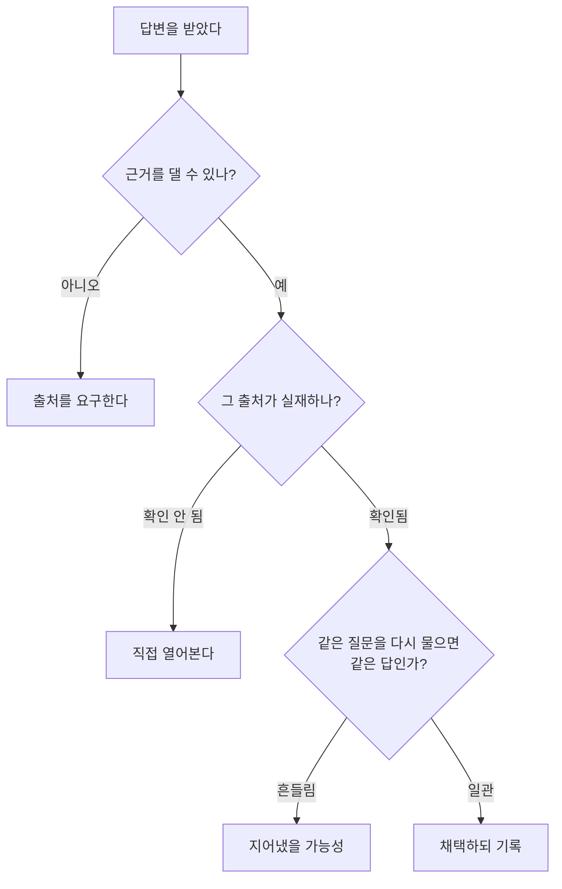

환각은 LLM 이야기에서 가장 많이 나오는 주제인데, 정작 설명은 부정확한 게 많습니다. "AI가 거짓말을 한다"거나 "학습 데이터가 부족해서"로 뭉뚱그리는 식입니다.

두 가지를 나눠서 보면 훨씬 선명해집니다. **무엇을 환각이라 부르는가**, 그리고 **왜 사라지지 않는가**입니다.

## 먼저 두 종류를 나눠야 합니다

환각은 한 덩어리가 아닙니다. Lilian Weng의 [정리](https://lilianweng.github.io/posts/2024-07-07-hallucination/)를 따르면 이렇게 갈립니다.

| 종류 | 무엇과 어긋나나 |
|---|---|
| **In-context (내재적)** | **주어진 자료**와 어긋남. 문서를 줬는데 그 내용과 다른 말을 함 |
| **Extrinsic (외재적)** | **세상의 사실**과 어긋남. 학습 데이터에도 근거가 없는 것을 지어냄 |

이 구분이 실무에서 중요합니다. **RAG로 잡을 수 있는 건 주로 두 번째**입니다. 근거 문서를 붙여줘서 세상 지식의 빈틈을 메우는 것이니까요.

반대로 문서를 줬는데도 그 문서와 다른 말을 한다면, 그건 자료를 더 준다고 해결되지 않습니다. **다른 문제**입니다.

> 요약 결과가 원문과 다르다면 in-context 환각이고, 없는 논문을 지어냈다면 extrinsic 환각입니다. 대처법이 다릅니다.
{: .prompt-info }

## 왜 생기나 — 데이터 쪽 원인

Weng이 짚는 원인은 둘입니다.

**하나, 사전학습 데이터 자체에 틀린 정보가 있습니다.** 인터넷에서 긁어온 방대한 말뭉치에는 낡은 정보, 빠진 정보, 잘못된 정보가 섞여 있고 모델은 그걸 그대로 외웁니다.

**둘, 새 지식을 파인튜닝으로 넣으면 오히려 환각이 늘 수 있습니다.** Gekhman 외(2024)의 연구에 따르면 모델은 **새로운 지식이 담긴 예시를 다른 예시보다 느리게 학습하고**, 일단 학습하고 나면 환각 경향이 커집니다.

두 번째는 직관에 반해서 기억해둘 만합니다. "우리 회사 정보를 파인튜닝으로 넣으면 정확해지겠지"가 늘 맞지는 않습니다.

## 그런데 왜 사라지지 않나

여기가 최근 연구의 관점입니다. 데이터를 아무리 정제해도 환각이 남는 이유가 따로 있다는 것입니다.

[Why Language Models Hallucinate](https://arxiv.org/abs/2509.04664) (Kalai 외, 2025-09)는 첫 문장부터 비유를 던집니다.

> 어려운 시험 문제를 마주한 학생처럼, 언어모델은 불확실할 때 **추측한다** — 모른다고 인정하는 대신 그럴듯하지만 틀린 진술을 내놓는다.

논문의 주장은 **평가 방식이 추측을 보상한다**는 것입니다.

{: .align-center}*"모르겠다"가 오답과 같은 점수라면, 찍는 게 언제나 이득입니다*

대부분의 벤치마크에서 "모르겠다"는 오답과 똑같이 0점입니다. 그러면 확신이 없을 때 기권할 이유가 사라집니다. 찍으면 맞을 가능성이라도 있으니까요.

논문의 표현을 빌리면 **모델은 시험을 잘 보도록 최적화**되고, 불확실할 때 찍는 것은 시험 성적을 올립니다.

그래서 처방도 기술적인 게 아니라 **사회기술적(socio-technical)**입니다. 환각 측정용 벤치마크를 새로 만들 게 아니라, **이미 리더보드를 지배하는 기존 벤치마크의 채점 방식을 고치자**는 것입니다.

> 이 논문은 환각을 신비한 현상이 아니라 **이진 분류의 오류**로 봅니다. 참과 거짓을 구분할 수 없다면 통계적 압력만으로도 환각은 발생한다는 것입니다.
{: .prompt-tip }

## 어떻게 줄이나

Weng의 정리를 실무 관점으로 묶으면 이렇습니다.

**검출**

| 방법 | 방식 |
|---|---|
| 검색 기반 검증 | 생성물을 원자 단위 사실로 쪼개 지식베이스와 대조 (FActScore, SAFE, FacTool) |
| 샘플링 일관성 | 같은 질문을 여러 번 물어 답이 흔들리는지 본다 (SelfCheckGPT) |
| 캘리브레이션 | 모델의 확신도가 실제 정확도와 맞는지 측정 |
| 간접 질문 | "X가 있나?"가 아니라 X에 대한 부수 질문으로 일관성을 본다 |

**완화**

| 방법 | 방식 |
|---|---|
| **RAG** | 외부 문서를 검색해 근거로 붙인다 |
| 검증 사슬 | 모델이 스스로 검증 질문을 만들고 답한 뒤 수정 (CoVe) |
| 샘플링 조정 | 생성 중 무작위성을 동적으로 낮춘다 |
| 정렬 학습 | 사실성을 보상으로 파인튜닝 |
| 출처 표기 학습 | 검색한 근거를 인용하도록 학습 (WebGPT) |

샘플링 일관성 방법이 왜 통하는지는 직관적입니다. **아는 것은 여러 번 물어도 같은 답이 나오고, 지어낸 것은 물을 때마다 달라집니다.**

## 검출이 어려운 이유

Weng이 짚는 한계가 현실적입니다.

> 사전학습 데이터의 규모를 생각하면, **생성할 때마다 검색해서 충돌을 확인하는 것은 너무 비싸다.**

그래서 완전한 검출은 사실상 불가능하고, 실무에서는 **비용을 감당할 수 있는 범위에서 부분적으로** 할 수밖에 없습니다.

## 실무에서 할 수 있는 것

앞의 방법들을 우리가 쓰는 수준으로 내리면 이렇습니다.

- **출처를 요구하고 실제로 열어봅니다.** 없는 논문·없는 API를 지어내는 건 링크를 눌러보면 바로 드러납니다
- **중요한 답은 새 대화에서 다시 물어봅니다.** 답이 흔들리면 근거가 약하다는 신호입니다
- **문서를 줬는데도 어긋난다면** 자료를 더 주는 게 답이 아닙니다. 문서가 너무 길어 묻혔는지, 지시가 모호했는지를 봐야 합니다
- **파인튜닝이 만능이 아닙니다.** 새 지식을 넣는 용도라면 RAG를 먼저 검토하는 편이 낫습니다

## 정리

환각은 두 층위의 문제입니다.

**데이터 층위**에서는 틀린 정보를 외웠거나 모르는 것을 채워 넣습니다. 이건 검색을 붙이거나 근거를 요구해서 상당 부분 줄일 수 있습니다.

**인센티브 층위**에서는 다릅니다. 모른다고 말하는 것이 손해인 구조라면, 모델은 계속 추측합니다. 이건 사용자가 프롬프트로 고칠 수 있는 문제가 아니라 **평가 방식이 바뀌어야 하는 문제**입니다.

당장 우리가 할 수 있는 건 첫 번째 층위이고, 두 번째는 업계가 채점표를 고치는지 지켜보는 수밖에 없습니다.

다음 편에서는 가장 널리 쓰이는 대처법인 **RAG**를 따로 다루겠습니다.

## 참고

- [Extrinsic Hallucinations in LLMs](https://lilianweng.github.io/posts/2024-07-07-hallucination/) — Lilian Weng, 2024-07-07 (2026-08-12 확인). 분류·원인·검출·완화의 뼈대는 이 글을 따랐습니다. **2024년 자료라 이후 연구는 반영돼 있지 않습니다**
- [Why Language Models Hallucinate](https://arxiv.org/abs/2509.04664) — Kalai, Nachum, Vempala, Zhang, 2025-09-04 (2026-08-12 arXiv 원문 확인). 인센티브 관점은 이 논문에서 가져왔습니다
- [컨텍스트 윈도우 — 대화가 길어지면 앞을 잊는 이유](/posts/context-window/) — 긴 문서가 묻히는 문제를 다뤘습니다
