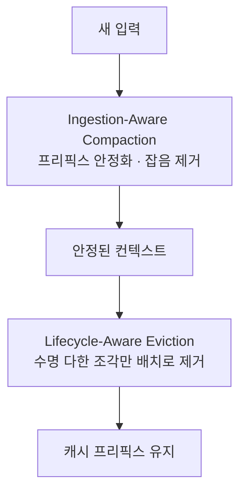

앞서 [컨텍스트 윈도우](/posts/context-window/)에서 대화가 길어지면 왜 앞을 잊는지 봤고, [토큰](/posts/llm-token-basics/) 편에서 프롬프트 캐싱으로 비용을 줄이는 법을 봤습니다.

그런데 이 둘을 한꺼번에 하려고 하면 문제가 생깁니다. **컨텍스트를 줄이는 행위가 캐시를 깨뜨립니다.**

오늘 볼 논문은 그 충돌을 정면으로 다룹니다 — [TokenPilot: Cache-Efficient Context Management for LLM Agents](https://arxiv.org/abs/2606.17016) (Xu 외, 2026-06).

> 이 논문은 **"LightMem Series: Work in Progress"** 로 표기된 진행 중인 연구입니다. 결과를 확정된 것으로 읽지 않는 편이 좋습니다.
{: .prompt-warning }

## 문제 — 줄이려고 자르면 캐시가 깨진다

에이전트가 오래 돌수록 컨텍스트가 쌓이고 추론 비용이 올라갑니다. 그래서 안 쓰는 부분을 잘라내는 방법들이 나왔습니다. 텍스트 가지치기(pruning), 동적 메모리 제거 같은 것들입니다.

논문이 지적하는 건 **그 방법들이 시퀀스를 자유롭게 변형한다**는 점입니다. 중간을 들어내면 뒤가 앞으로 당겨지고, **배치가 바뀌면서 프리픽스가 어긋나** 캐시가 무효화됩니다.

{: .align-center}*중간을 들어내면 그 뒤는 전부 다시 계산해야 합니다*

토큰 편에서 캐싱은 **앞에서부터 정확히 일치하는 부분까지만** 재사용된다고 했습니다. 시스템 프롬프트 맨 앞에 시각을 넣으면 그 뒤가 전부 캐시에서 빠지는 것과 같은 원리입니다.

논문은 이걸 **텍스트 희소성(text sparsity)과 프롬프트 캐시 연속성(prompt cache continuity) 사이의 트레이드오프**라고 부릅니다.

토큰을 줄이려고 자를수록 캐시가 깨져서, **줄인 만큼 아낀 게 다시 계산하는 비용으로 상쇄됩니다.**

## TokenPilot의 두 장치

논문은 문맥 관리를 **전역과 지역, 두 층위**로 나눕니다.

| 층위 | 장치 | 하는 일 |
|---|---|---|
| 전역 | **Ingestion-Aware Compaction** | 입력 관문에서 프리픽스를 안정화하고 환경 잡음을 제거 |
| 지역 | **Lifecycle-Aware Eviction** | 문맥 조각의 잔여 효용을 감시하다 관련성이 만료될 때만 내보냄 |

핵심은 **어디를 건드리느냐**입니다.

앞쪽(프리픽스)은 고정해서 캐시가 살아남게 하고, 정리는 뒤쪽에서만 합니다. 그것도 즉시 지우지 않고 **보수적인 배치-턴 일정**에 따라, 그 조각의 쓸모가 실제로 끝났을 때만 내보냅니다.

논문이 첫 번째 장치를 **"프레임워크 하네스로 작동한다"**고 표현한 것도 눈에 띕니다.

## 결과

두 벤치마크(PinchBench, Claw-Eval)에서 isolated·continuous 두 모드로 평가했습니다.

| 모드 | 비용 절감 |
|---|---|
| isolated | 61%, 56% |
| continuous | 61%, 87% |

성능은 기존 시스템 대비 경쟁력을 유지했다고 보고합니다.

## 읽고 나서 — 개인적인 생각

여기부터는 논문의 주장이 아니라 제 판단입니다.

**가장 쓸모 있는 건 결과 수치가 아니라 문제 정의입니다.** 컨텍스트 압축 도구를 도입할 때 우리는 보통 "토큰이 몇 % 줄었나"만 봅니다. 그런데 이 논문 말이 맞다면 **캐시 히트율을 같이 보지 않으면 절감량을 과대평가**하게 됩니다. 줄인 토큰만큼 캐시가 깨져 재계산되면 실제 청구서는 기대만큼 안 줄어듭니다.

**절감률 편차는 크게 받아들이지 않는 게 좋겠습니다.** 56%에서 87%까지 벌어지는데, 모드와 벤치마크에 따라 달라진 것입니다. `PinchBench`와 `Claw-Eval` 둘 다 널리 쓰이는 벤치마크는 아니어서, 우리 워크로드에서 비슷한 수치가 나오리라 기대할 근거는 없습니다. **"이 정도 여지가 있다"** 정도로 읽는 게 맞습니다.

**같은 문제에 정반대 해법이 있다는 점이 흥미롭습니다.** [Prime Agent](/posts/prime-agent/)는 컨텍스트를 대화에 쌓지 않고 **파이썬 변수에 담아 밖에 둡니다.** TokenPilot은 대화 안에 있는 것을 잘 관리하는 쪽이고, Prime Agent는 애초에 안 쌓는 쪽입니다. 어느 쪽이 나은지는 아직 답이 없어 보이지만, 문제가 같다는 건 분명합니다.

**그리고 "하네스"라는 표현이 또 나왔습니다.** [Continual Harness](/posts/continual-harness/) 편에서 하네스를 "모델을 감싸는 것 전부"로 정리했는데, 이 논문도 압축 장치를 프레임워크 하네스라고 부릅니다. 용어가 특정 논문의 조어가 아니라 **분야 공통어로 자리잡아 가는 중**인 것 같습니다.

## 정리

컨텍스트 관리에서 **"줄이기"와 "캐시 유지"는 공짜로 양립하지 않습니다.**

TokenPilot의 답은 **자를 수 있는 곳을 제한하는 것**입니다. 앞은 고정하고 뒤에서만, 그것도 쓸모가 확실히 끝난 것만 내보냅니다. 자유도를 포기하는 대신 캐시를 지킵니다.

진행 중인 연구라 수치를 그대로 믿기보다는, **컨텍스트를 손댈 때 캐시가 함께 깨지고 있지 않은지 확인하라**는 문제 제기로 읽는 게 지금으로선 가장 실용적입니다.

## 참고

- [TokenPilot: Cache-Efficient Context Management for LLM Agents](https://arxiv.org/abs/2606.17016) — Xu 외 15명, 2026-06-15 (cs.CL, cs.AI, cs.LG, cs.MA). "LightMem Series: Work in Progress". 이 글의 사실관계는 arXiv 원문에서 확인했습니다 (2026-08-12 확인)
- [컨텍스트 윈도우 — 대화가 길어지면 앞을 잊는 이유](/posts/context-window/) — 이 시리즈 1편
- [토큰이란 무엇인가 — 글자 수와 다른 이유](/posts/llm-token-basics/) — 2편, 프롬프트 캐싱을 다뤘습니다
