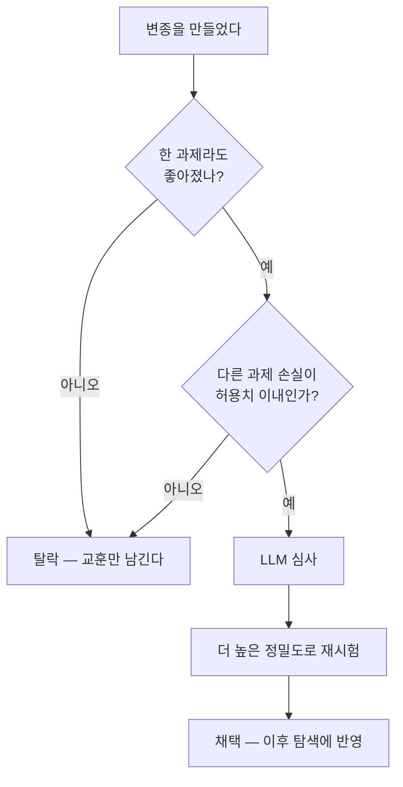

[하네스 엔지니어링](/posts/harness-engineering/) 편을 마치면서 "이 분야가 빠르게 커지고 있다"고 적었습니다. 그 말을 확인시켜주듯 하네스를 **자동으로 개선하는** 논문이 연달아 올라왔습니다.

재미있는 건 두 편이 같은 문제를 **정반대 방식**으로 푼다는 점입니다.

## 같은 문제, 다른 전략

둘 다 전제가 같습니다. **모델 가중치는 건드리지 않고**, 프롬프트·도구·스킬·제어흐름만 바꿔가며 더 나은 조합을 찾습니다.

| | AutoDesign | DarwinX |
|---|---|---|
| 탐색 구조 | **한 줄기**를 계속 고쳐나감 | **개체군**을 유지하며 선택 |
| 채택 기준 | 개발셋 성능이 안 떨어지면 수용 | 하나라도 좋아지고 나머지 손실이 임계 이내 |
| 실패한 갈래 | 버림 | **보관했다가 재조합** |
| 실험 대상 | 논문 → 포스터 생성 | 터미널·웹 에이전트 벤치마크 |
| 공개 | 2026-08-13 | 2026-07-31 |

{: .align-center}*탐색 구조만 남겨 다시 그린 것입니다 — 원문에는 이런 그림이 없습니다*

## AutoDesign — 한 줄기를 깊게 판다

[AutoDesign](https://arxiv.org/abs/2608.13560)은 루프가 두 겹입니다.

**안쪽 루프**는 결과물을 만듭니다. 디자이너 모듈이 산출물을 생성하고, 비평 모듈이 규칙 기반 검사와 시각 평가로 피드백을 돌려줍니다.

**바깥쪽 루프**는 하네스 자체를 고칩니다. 실행 기록과 채점 결과에서 **반복되는 실패**를 찾아내고, 코드 에이전트에게 구성요소를 고치라고 지시합니다.

여기서 중요한 제약이 둘 있습니다. **한 번에 구성요소 하나만** 바꾸고, **학습셋 성능이 올라가면서 개발셋 성능이 떨어지지 않을 때만** 채택합니다.

> 이 수용 게이트가 과적합을 막는 장치입니다. 없으면 "학습 과제에만 잘 듣는 하네스"로 수렴합니다.
{: .prompt-info }

### 결과

논문이 함께 내놓은 벤치마크는 **PosterBench**입니다. 5개 분야 100편으로 구성된 본 트랙과, 통제 실험용 10편짜리 mini 트랙이 있습니다.

| 측정 | 값 |
|---|---|
| PosterBench 본 트랙 | **78.32** — 상용 시스템(Claude Design) 대비 +7.45 |
| 코드 에이전트·모델 조합 7종 평균 | 54.99 → **67.39** (+12.4%) |
| 자율 루프 1회 | 도구 호출 253회, 편집 11턴, 40분, **$3 미만** |

가장 눈에 띄는 건 두 번째 줄입니다. 학습된 **DesignHarness를 다른 조합에 그대로 붙여도** 성능이 올랐다는 뜻입니다.

하네스가 특정 모델에 종속된 튜닝이 아니라 **옮길 수 있는 자산**이라는 주장이고, 이건 [3편](/posts/harness-engineering/)에서 본 "모델을 못 건드릴 때 남는 지렛대"라는 관점과 정확히 맞물립니다.

## DarwinX — 갈래를 여럿 들고 간다

[DarwinX](https://arxiv.org/abs/2608.07545)는 첫 문장부터 문제의식을 분명히 합니다.

> 자기개선 루프는 이미 하네스를 고치고 있다. 그런데 **단일 계보 탐색은 경로 의존적이고, 국소적인 개선이 다른 과제를 퇴행시키는 일이 잦다.**

그래서 하나를 고쳐나가는 대신 **여러 변종을 놓고 선택**합니다.

### 채택 규칙 — preserve-and-extend

자식 변종이 살아남는 조건이 둘입니다. **적어도 한 과제에서 측정 가능한 개선**이 있어야 하고, **다른 과제의 손실이 작은 허용치 안**이어야 합니다.

검증이 **두 단계**인 게 특징입니다. LLM 심사가 먼저 승격 여부를 판단하고, 그 뒤에 더 엄격한 재시험을 통과해야 비로소 이후 탐색에 영향을 줍니다.

적합도는 **각 벤치마크가 자체적으로 가진 검증자**에서 나옵니다. 정답 풀이도, 손으로 고른 승자도 쓰지 않습니다.

### 아카이브와 재조합

탈락한 갈래도 버리지 않습니다. 스냅샷·변경분·과제별 점수·근거를 **트리로 보관**합니다.

서로 다른 강점을 가진 가지가 생기면 편집분을 합쳐 새 후보를 만드는데, 이때 조건이 하나 붙습니다. **부모 둘이 풀던 과제의 합집합을 덮을 때만** 남깁니다.

능력을 맞바꾸는 게 아니라 **넓히는** 조합만 통과시키겠다는 뜻입니다.

### 배움의 출처 셋

| 종류 | 무엇에서 배우나 |
|---|---|
| 실패 기반 | 실패한 실행을 요약해 빠진 능력을 짚는다. 기본값 |
| 교사 기반 | 성공 사례가 없는 과제에서, 참조 풀이의 궤적을 재사용 가능한 방법으로 정제 |
| 자기 기반 | 자기 성공·실패를 대조해 **무엇이 안정성을 갈랐는지** 찾는다. 결과가 들쭉날쭉한 과제용 |

셋 다 최종적으로는 **하네스 편집**으로 변환됩니다. 가중치는 끝까지 건드리지 않습니다.

### 결과

논문이 보고한 값은 이렇습니다.

| 벤치마크 | 값 |
|---|---|
| 4개 벤치마크 평균 | 루프 1회에 약 **+17점** |
| Terminal-Bench 2.1 | +7.7 → **83.2%** (동일 베이스), 더 강한 베이스에서 **84.7%** |
| TerminalWorld (홀드아웃) | **68.3%** |
| WebArena-Infinity pass@1 | 43.5% → **93.0%** |
| 전이 | Terminal-Bench 하네스가 **수정 없이** SWE-bench Verified 로 |

마지막 줄이 논문의 핵심 주장입니다. 벤치마크에 맞춘 땜질이 아니라 **일반적인 에이전트 역량**이 진화했다는 것입니다.

## 두 논문이 맞물리는 지점

DarwinX가 지적한 "단일 계보 탐색"이 **정확히 AutoDesign의 구조**입니다.

다만 시점을 보면 서로를 겨냥한 건 아닙니다. DarwinX가 7월 31일, AutoDesign이 8월 13일이라 **같은 문제의식이 동시에 나온 쪽**에 가깝습니다.

그래서 어느 쪽이 옳다기보다, **탐색 비용을 어디에 쓸 것인가**의 선택으로 읽는 게 맞다고 봅니다. 한 줄기를 깊게 파면 싸고 빠르지만 지나친 선택지로 돌아갈 수 없고, 개체군을 유지하면 되돌아갈 수 있는 대신 비쌉니다.

## 3편에서 남긴 문제들은 어떻게 됐나

[하네스 엔지니어링](/posts/harness-engineering/) 편에서 Lilian Weng이 미해결로 남긴 일곱 가지를 정리했었습니다. 이번 두 논문이 그중 몇 개를 직접 건드립니다.

| Weng이 남긴 문제 | 이번 논문의 대응 |
|---|---|
| **다양성 붕괴** | DarwinX의 아카이브·재조합이 정면으로 겨냥 |
| **부정적 결과** | DarwinX가 실패 기록을 학습 신호로 명시 |
| **보상 해킹** | 둘 다 수용 게이트를 루프 밖에 둠 |
| **약한 평가자** | **여전히 남음** — 아래 참고 |

앞의 셋은 진전이 보입니다. 마지막 하나가 문제입니다.

## 읽을 때 붙여야 할 단서

여기부터는 제 판단입니다.

**수치는 전부 저자들의 보고입니다.** 두 논문 모두 arXiv 프리프린트이고, 제3자 재현은 아직 없습니다.

**AutoDesign의 실험 대상은 좁습니다.** 논문→포스터 생성 한 과제입니다. "long-horizon agentic design" 이라는 일반화는 아직 주장 단계로 보는 게 안전합니다.

**WebArena-Infinity의 43.5% → 93.0% 는 유난히 큽니다.** 논문이 `audit-clean` 이라는 단서를 붙여둔 걸 보면 저자들도 의식하고 있는 듯한데, 이 숫자 하나만 떼어 인용하는 건 피하는 게 좋겠습니다.

**그리고 둘 다 평가자에 기대고 있습니다.** DarwinX는 벤치마크 자체 검증자를, AutoDesign은 규칙 검사와 시각 평가를 씁니다. 검증자가 명확한 영역이라 성립하는 방식이고, Weng이 말한 "연구 감각처럼 빠르고 정확한 검증자가 없는 영역"에서는 그대로 막힙니다.

> **측정할 수 있는 것만 진화합니다.** 자기개선 루프의 성능은 결국 평가자의 품질을 넘지 못합니다.
{: .prompt-warning }

## 정리

하네스 자동 개선은 **탐색 문제**로 자리를 잡아가는 중입니다.

AutoDesign은 한 줄기를 깊게 파서 옮길 수 있는 하네스를 만들었고, DarwinX는 갈래를 여럿 유지해 경로 의존성을 줄였습니다. 접근은 반대지만 **모델을 얼어붙인 채 감싸는 것만 바꾼다**는 전제는 같습니다.

DarwinX의 초록 마지막 문장이 이 흐름을 잘 요약합니다.

> 얼어붙은 모델이 곧 고정된 에이전트일 필요는 없다.

다만 3편에서 본 단서는 그대로 유효합니다. 하네스는 모델의 능력을 **끌어내는** 것이지 만들어내는 것이 아니고, 이제 여기에 하나가 더 붙습니다 — **평가할 수 없는 것은 개선되지 않습니다.**

## 참고

- [AutoDesign: Meta-Harness Optimization for Long-Horizon Agentic Design](https://arxiv.org/abs/2608.13560) — Luo 외, 2026-08-13 (2026-08-14 arXiv 원문 확인). 초록과 방법 절에서 확인했습니다
- [DarwinX: Evolving Agent Harnesses Through Natural Selection](https://arxiv.org/abs/2608.07545) — Zhang 외, 2026-07-31 (2026-08-14 arXiv 원문 확인). 인용문은 초록에서 옮겼습니다
- [하네스 엔지니어링 — 어디까지 스스로 나아질 수 있나](/posts/harness-engineering/) — 이 글이 놓이는 지형도
- [Continual Harness](/posts/continual-harness/) — 온라인 하네스 개선을 다룬 앞선 논문
- [Prime Agent 뜯어보기](/posts/prime-agent/) — 하네스 자기수정이 실제 도구에 들어간 사례
