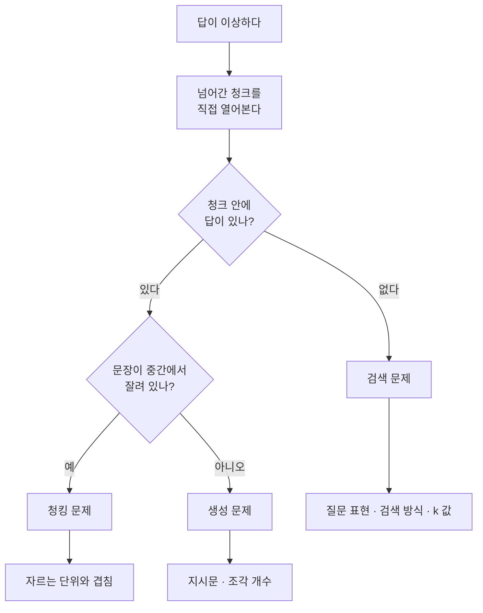

[환각 편](/posts/llm-hallucination/) 끝에서 RAG를 따로 다루겠다고 적었습니다. 이번 글이 그 편입니다.

상황을 하나 떠올려 보겠습니다. 사내 규정 문서가 200페이지 있고, "출장비 정산 기한이 며칠인가"를 LLM에게 묻고 싶습니다.

이 문서는 모델이 학습한 적이 없습니다. 그냥 물으면 모델은 일반적인 관행을 근거로 그럴듯한 숫자를 만들어냅니다. 환각 편에서 본 두 번째 종류, 세상 지식의 빈틈입니다.

RAG는 이 상황을 다루는 가장 널리 쓰이는 방법입니다.

## 이름부터 풀면

RAG는 Retrieval-Augmented Generation, **검색으로 보강한 생성**입니다.

[원 논문](https://arxiv.org/abs/2005.11401)은 이것을 두 종류의 기억으로 설명합니다. 모델 가중치 안에 들어 있는 **파라메트릭 메모리**와, 밖에 두고 필요할 때 찾아오는 **비파라메트릭 메모리**입니다.

앞의 것은 사람이 외워둔 지식이고, 뒤의 것은 필요할 때 책장에서 찾아보는 지식에 가깝습니다.

RAG가 하는 일은 한 줄로 정리됩니다. **답하기 전에 관련 문서를 찾아서, 질문과 함께 모델에게 건네주는 것**입니다.

모델을 다시 학습시키지 않는다는 점이 중요합니다. 문서가 바뀌면 문서만 갈아끼우면 됩니다.

## 그냥 200페이지를 다 붙여넣으면 안 되나

요즘 컨텍스트 윈도우는 충분히 큽니다. 그래서 이 질문이 자연스럽게 나옵니다.

두 가지 문제가 있습니다.

**첫째, 질문마다 돈이 듭니다.** 입력도 토큰 단위로 과금되니, 물어볼 때마다 200페이지를 다시 밀어넣는 셈입니다. ([토큰](/posts/llm-token-basics/) 편에서 다뤘습니다)

**둘째, 길어지면 중간을 놓칩니다.** [Lost in the Middle](https://arxiv.org/abs/2307.03172)이 측정한 현상입니다.

> 관련 정보가 입력의 **처음이나 끝**에 있을 때 성능이 가장 높고, **긴 맥락의 중간**에서 찾아야 할 때 크게 떨어진다.
{: .prompt-warning }

긴 맥락을 겨냥해 만든 모델에서도 이 경향이 나타났습니다. 창을 넓히는 것만으로 해결되는 문제가 아니라는 뜻입니다. ([컨텍스트 윈도우](/posts/context-window/) 편과 이어집니다)

그래서 전부 넣는 것보다 **필요한 몇 조각만 골라 넣는 편**이 더 잘 듣습니다. 이것이 RAG를 쓰는 실질적인 이유입니다.

## 동작 순서

여기서 처음 배우는 분들이 가장 많이 헷갈리는 게 있습니다. RAG는 **두 시점**으로 나뉩니다.

{: .align-center}*직접 그린 그림입니다. 원 논문에는 이런 형태의 도식이 없습니다*

**① 미리 한 번** — 문서를 검색 가능한 형태로 만들어 저장합니다. 문서가 바뀔 때만 다시 합니다.

**② 물어볼 때마다** — 질문이 들어오면 저장소에서 관련 조각을 찾아 프롬프트에 붙입니다.

이 구분이 실무에서 바로 쓰입니다. 색인 비용은 한 번이고, 검색과 생성 비용은 질문마다 듭니다.

### 용어

| 용어 | 하는 일 |
|---|---|
| 청킹(chunking) | 긴 문서를 검색 단위로 자릅니다. 문서 하나가 아니라 조각을 찾아옵니다 |
| 임베딩(embedding) | 글을 숫자 목록(벡터)으로 바꿉니다. 뜻이 비슷하면 숫자도 가까워집니다 |
| 벡터 저장소 | 벡터를 넣어두고 "가까운 것"을 빠르게 찾아주는 데이터베이스입니다 |
| 검색기(retriever) | 질문 벡터와 가까운 청크를 k개 꺼내옵니다 |
| 리랭커(reranker) | 꺼내온 조각들을 다시 채점해 순서를 고칩니다 |

임베딩이 왜 "뜻이 비슷하면 가까워지는지"는 그 자체로 한 편 분량이라, 이 글에서는 결과만 쓰겠습니다.

### 모델이 실제로 받는 것

RAG라고 해서 특별한 API를 쓰는 게 아닙니다. 조립된 프롬프트가 넘어갈 뿐입니다.

```text
아래 문서만 근거로 답하세요. 문서에 없으면 모른다고 답하세요.

[문서 1] 출장비는 귀국일로부터 14일 이내에 정산한다. ...
[문서 2] ...

질문: 출장비 정산 기한이 며칠인가?
```

실행 가능한 코드가 아니라, 조립 결과가 어떤 모양인지 보여주는 예시입니다.

두 번째 문장 — **문서에 없으면 모른다고 답하라** — 를 빼면 안 됩니다. 이 한 줄이 없으면 모델은 검색된 문서를 제쳐두고 외운 지식으로 답해버립니다.

## 답이 이상할 때 어디를 보나

RAG가 기대만큼 안 나올 때 가장 흔한 대응은 프롬프트를 고치는 것입니다. 그런데 원인은 대개 **검색 쪽**에 있습니다.

진단에는 순서가 있습니다. 먼저 **모델에게 넘어간 조각을 직접 눈으로 봅니다.**



- **청크에 답이 없다** → 검색 문제입니다. 프롬프트를 아무리 고쳐도 안 됩니다
- **청크에 답이 있는데 틀리게 답한다** → 생성 문제입니다. 지시가 모호했거나, 조각이 너무 많아 묻혔습니다
- **청크가 문장 중간에서 잘려 있다** → 청킹 문제입니다. 답의 앞뒤가 다른 조각으로 갈렸을 수 있습니다

이 세 갈래를 구분하는 것만으로 헛수고가 크게 줄어듭니다. 환각 편에서 "문서를 줬는데도 어긋난다면 자료를 더 주는 게 답이 아니다"라고 적은 것과 같은 이야기입니다.

## 처음에 무엇으로 시작할까

기본값을 정하는 데 시간을 덜 쓰려면, 각 단계의 선택지를 실험으로 비교한 논문이 하나 있습니다. [Searching for Best Practices in Retrieval-Augmented Generation](https://arxiv.org/abs/2407.01219)입니다.

| 항목 | 논문의 권고 |
|---|---|
| 청크 크기 | 512 토큰 |
| 검색 방식 | **하이브리드** — 키워드 검색(BM25)과 벡터 검색을 함께 |
| 리랭킹 | 넣는 편이 낫습니다. 빼면 성능이 눈에 띄게 떨어졌습니다 |

하이브리드가 필요한 이유는 직관적입니다. 벡터 검색은 뜻이 비슷한 것을 잘 찾지만, **제품 코드나 사람 이름처럼 정확히 그 글자**를 찾는 일에는 키워드 검색이 낫습니다.

> 이 논문은 2024년 7월 자료이고, 권고는 논문이 쓴 데이터셋과 모델 조합에서 나온 것입니다. 출발점으로 삼되 자기 데이터에서 다시 재보는 편이 좋습니다.
{: .prompt-warning }

## RAG가 못 하는 것

**검색이 틀리면 거기서 끝입니다.** 엉뚱한 조각을 가져오면 모델이 그 조각을 근거로 성실하게 틀린 답을 만듭니다. RAG의 품질 상한은 검색의 품질입니다.

**문서 전체를 훑어야 하는 질문에 약합니다.** "이 규정집에서 가장 자주 나오는 예외 조건은?" 같은 질문은 조각 몇 개로 답할 수 없습니다.

**근거를 붙여도 환각이 완전히 사라지지는 않습니다.** 환각 편의 두 층위 중 데이터 층위를 줄이는 방법이고, 모른다고 말하는 것이 손해인 인센티브 층위는 그대로 남습니다.

**최신성은 문서 갱신 주기까지입니다.** 색인을 다시 만들지 않으면 저장소는 어제의 문서를 그대로 들고 있습니다.

## 정리

RAG는 모델을 고치지 않고 **모델이 보는 것을 고치는** 방법입니다.

동작은 두 시점으로 나뉩니다. 문서를 잘라 벡터로 만들어 저장하는 일은 미리 한 번, 질문에 맞는 조각을 찾아 붙이는 일은 물어볼 때마다 합니다.

전부 붙여넣지 않는 이유는 비용과 중간 손실 두 가지이고, 잘 안 될 때는 프롬프트보다 **넘어간 청크**를 먼저 봐야 합니다.

그리고 RAG는 검색이 맞았을 때만 동작합니다. 이 점을 잊으면 프롬프트만 고치며 오래 헤매게 됩니다.

다음 편에서는 이 글에서 결과만 쓰고 넘어간 **임베딩**을 따로 다루겠습니다.

## 참고

- [Retrieval-Augmented Generation for Knowledge-Intensive NLP Tasks](https://arxiv.org/abs/2005.11401) — Lewis 외, 2020-05-22 (2026-08-14 arXiv 원문 확인). 파라메트릭 / 비파라메트릭 메모리 구분을 가져왔습니다
- [Lost in the Middle: How Language Models Use Long Contexts](https://arxiv.org/abs/2307.03172) — Liu 외, 2023-07-06, TACL 2023 (2026-08-14 arXiv 원문 확인). 인용문은 초록을 옮긴 것입니다
- [Searching for Best Practices in Retrieval-Augmented Generation](https://arxiv.org/abs/2407.01219) — Wang 외, 2024-07-01 (2026-08-14 arXiv 원문 확인). 청크 크기·하이브리드 검색·리랭킹 권고의 출처입니다. **2024년 자료입니다**
- [환각은 왜 생기고 왜 사라지지 않나](/posts/llm-hallucination/) — 이 글이 이어받는 앞 편
- [컨텍스트 윈도우 — 대화가 길어지면 앞을 잊는 이유](/posts/context-window/) — 긴 입력에서 중간이 묻히는 문제
- [토큰이란 무엇인가 — 글자 수와 다른 이유](/posts/llm-token-basics/) — 입력 비용이 토큰으로 계산되는 이유
